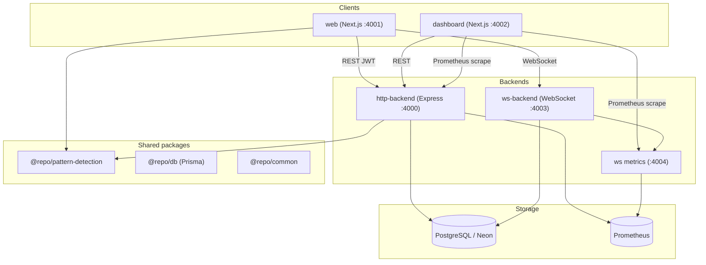
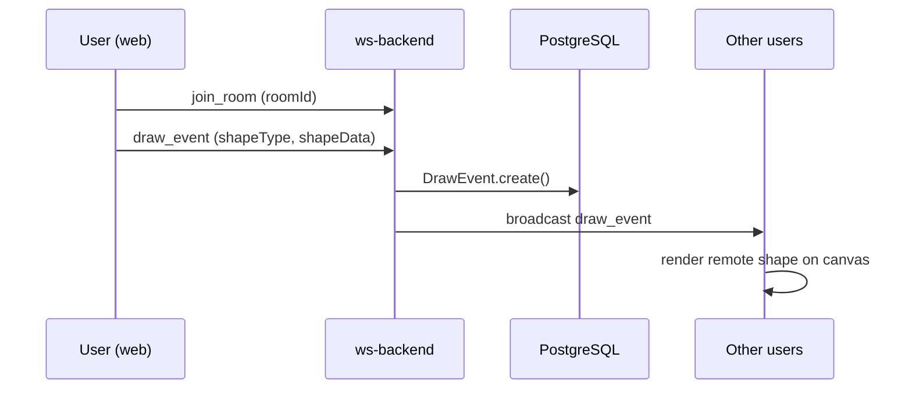
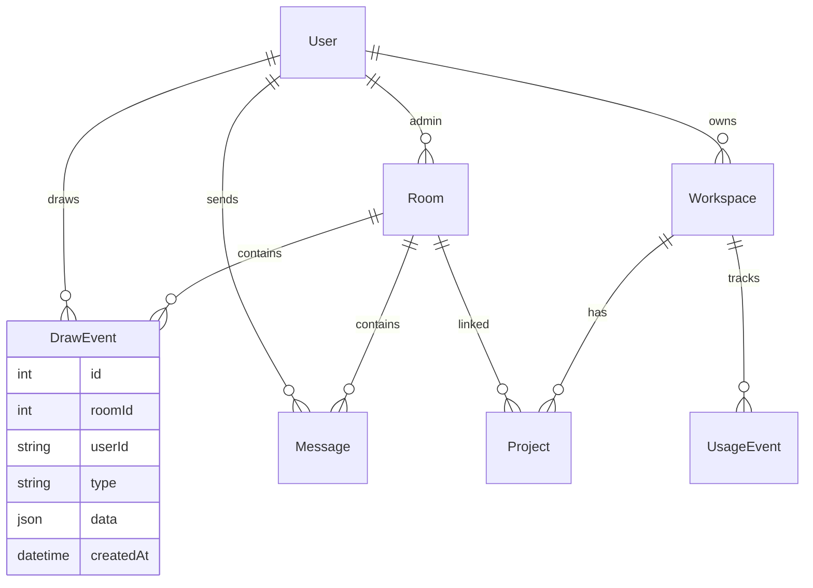

# Architecture — Pattern Detection in Time Series Data

This document explains how the **SketchUI / Excalidraw** monorepo is structured, how the system works end-to-end, and how it implements the academic topic **pattern detection in time series data**.

---

## 1. Project purpose

The project is a **real-time collaborative drawing platform** (Excalidraw-style) extended with **SketchUI**: a sketch-to-wireframe pipeline that detects UI components and exports production code.

At its core, the platform treats drawing and user activity as **time series**:

| Data source | Time series representation | Pattern-detection use |
|---|---|---|
| Pencil strokes | `{ x(t), y(t) }` sampled over time | DTW shape matching, sliding-window detection, velocity profiles |
| Draw events in a room | Event timestamps → activity rate buckets | CUSUM changepoint detection, Z-score anomaly detection |
| HTTP / WebSocket metrics | Prometheus counters over time | Operational monitoring and dashboarding |

Every stroke is a **multivariate time series**. Session behaviour is a **univariate activity-rate time series**. Both are analysed with classical time-series algorithms.

---

## 2. High-level system architecture



### Runtime services

| Service | Port | Role |
|---|---|---|
| **web** | 4001 | Drawing canvas, auth, projects, real-time collaboration UI |
| **dashboard** | 4002 | Visualises pattern-detection stats, session analysis, Prometheus charts |
| **http-backend** | 4000 | REST API: auth, rooms, drawings, workspaces, pattern-stats, session-analysis, `/metrics` |
| **ws-backend** | 4003 | WebSocket: draw events, cursors, chat; persists to DB |
| **ws metrics** | 4004 | Prometheus metrics for WebSocket layer |

All apps share a **Turborepo** monorepo (`pnpm` workspaces). Pattern-detection logic lives in `@repo/pattern-detection` and is consumed by both the web client and http-backend.

---

## 3. Monorepo layout

```
excalidraw/
├── apps/
│   ├── web/              # Next.js drawing app (SketchUI canvas)
│   ├── dashboard/        # Pattern-detection & metrics dashboard
│   ├── http-backend/     # REST API + session analysis endpoints
│   └── ws-backend/       # Real-time WebSocket server
├── packages/
│   ├── pattern-detection/  # ★ Core algorithms (DTW, CUSUM, UI pipeline)
│   ├── db/                   # Prisma schema + client
│   ├── common/               # Zod schemas, shared types
│   ├── backend-common/       # JWT config, shared backend utilities
│   └── ui/                   # Shared React components
├── monitoring/             # Prometheus config
└── docker-compose.monitoring.yml
```

---

## 4. Application flows

### 4.1 Authentication and projects

1. User signs up / signs in via **http-backend** (`POST /signup`, `POST /signin`).
2. JWT is stored in the browser and sent on every API and WebSocket request.
3. **Projects** (SketchUI SaaS layer) link a workspace to a drawing **room** via Prisma models `Workspace`, `Project`, `UsageEvent`.

### 4.2 Real-time drawing



- **Local-first**: shapes are added to React state immediately for low latency.
- **Broadcast**: ws-backend relays events to all clients in the same room (except the sender for draw events).
- **Persistence**: each draw event is stored as a `DrawEvent` row (`type`, `data` JSON, `createdAt`).

### 4.3 SketchUI detection pipeline (on the canvas)

When the user draws with the pencil or drops wireframe components:

```
Canvas strokes / wireframes
        │
        ▼
┌───────────────────────────────────────────────────┐
│  Per-stroke classification (classifyUIComponent)   │
│  Heuristic features + DTW template matching        │
└───────────────────────────────────────────────────┘
        │
        ▼
┌───────────────────────────────────────────────────┐
│  Spatial clustering (DBSCAN)                     │
│  Merge overlapping bounding boxes                  │
└───────────────────────────────────────────────────┘
        │
        ▼
┌───────────────────────────────────────────────────┐
│  Layout tree (containment hierarchy)               │
│  Row/column gap inference                          │
└───────────────────────────────────────────────────┘
        │
        ▼
┌───────────────────────────────────────────────────┐
│  Code export (React + Tailwind / HTML)             │
│  Optional Gemini premium generation                │
└───────────────────────────────────────────────────┘
```

The **AnalysisPanel** (Detection / Layout / Code tabs) surfaces these results in the web UI.

### 4.4 Chat and collaboration

- **Chat**: WebSocket `chat_message` → saved to `Message` table → broadcast to room.
- **Live cursors**: `cursor_move` events with throttled position updates.
- **Room users**: join/leave notifications and presence list.

---

## 5. Pattern detection in time series data

This section maps the project directly to the topic **pattern detection in time series data**.

### 5.1 What is a “pattern” in this project?

In time-series analysis, a **pattern** is a recurring or significant structure in sequential data. This project detects patterns at three levels:

1. **Stroke patterns** — geometric shapes (circle, rectangle, line, UI components) in `{x, y, t}` series.
2. **Behavioural patterns** — bursts, idle periods, changepoints in session activity rates.
3. **Operational patterns** — request rates, draw-event counts, connection counts over time (Prometheus).

### 5.2 Stroke-level time series (drawing data)

Each pencil point is recorded as:

```typescript
{ x: number, y: number, t: number }  // t = timestamp (ms)
```

This is a **multivariate time series** sampled irregularly in time. The pipeline:

#### A. Path normalisation (`normalizePath.ts`)

- Resamples the stroke to a fixed number of points.
- Normalises coordinates to a standard bounding box.
- Preserves temporal ordering for DTW alignment.

#### B. Dynamic Time Warping — DTW (`dtw.ts`)

**DTW** is the canonical algorithm for comparing two time series that may differ in speed or length. It finds an optimal alignment between a user stroke and ideal shape templates (circle, rectangle, triangle, line, star).

- Uses **Sakoe–Chiba band** optimisation to limit the warping path.
- Returns a **normalised distance** and **confidence** score.
- Used in both final detection and real-time sliding window.

#### C. Sliding window detection (`slidingWindow.ts`)

For **streaming** pattern detection while the user is still drawing:

```
Points arrive: p₁, p₂, …, pₙ
Every `step` new points:
  1. Take last `windowSize` points
  2. Normalise window
  3. DTW match against all templates
  4. Smooth confidence with EMA (Exponential Moving Average)
  5. If smoothed confidence ≥ threshold → emit LiveDetection
```

This mirrors real-time time-series monitoring: a fixed window slides over incoming data, and patterns are detected before the series ends.

#### D. Kinematic features (`timeSeriesFeatures.ts`)

From the timestamped stroke, the system derives **derived time series**:

| Derived series | Meaning |
|---|---|
| Velocity `v(t)` | Speed at each segment: `‖Δp‖ / Δt` |
| Acceleration `a(t)` | Rate of change of velocity |
| Velocity profile label | `constant`, `slow-fast-slow`, `multi-peak`, `burst` |

Examples:

- **Circle** → relatively constant velocity.
- **Rectangle** → multi-peak velocity (corners cause speed changes).
- **Line** → slow–fast–slow profile.

These features enrich detection metadata stored in the database and shown on the dashboard.

#### E. Combined geometric + DTW detection (`geometricDetect.ts`)

On stroke completion (`mouseUp`):

1. Geometric heuristics score the normalised path (convex hull, radius variance, etc.).
2. DTW matches against templates.
3. Velocity features are extracted.
4. Scores are **combined** (agreement boosts confidence; disagreement picks the stronger signal).

Results are stored as `DrawEvent` rows with `type: "completion"` or `"analysis"` and JSON metadata:

```json
{
  "detectedLabel": "rectangle",
  "confidence": 0.87,
  "method": "combined",
  "dtwDistance": 0.12,
  "velocityProfile": "multi-peak",
  "strokeDuration": 842,
  "meanSpeed": 0.45
}
```

### 5.3 Session-level time series (behavioural data)

Draw events in a room have **timestamps**. These are converted into an **activity-rate time series**:

```
eventTimestamps[]  →  bucket into 2s windows  →  ActivityPoint { t, value }
```

`eventTimesToActivitySeries()` in `anomalyDetection.ts` performs this aggregation.

#### A. Z-score sliding window (`detectAnomaliesZScore`)

For each point in the activity series:

- Compute mean and standard deviation over the preceding window.
- Flag points where `|z| > threshold` as anomalies.
- Classify as **burst** (high activity) or **idle** (low activity).

#### B. CUSUM changepoint detection (`detectChangepointsCUSUM`)

**CUSUM** (Cumulative Sum control chart, Page 1954) accumulates small deviations from a target mean:

- Detects **upward shifts** (activity suddenly increases).
- Detects **downward shifts** (user slows down or stops).
- Marks **changepoints** where behaviour switches (e.g. sketching → idle).

#### C. Session classification (`analyseSession`)

Combines anomalies, idle fraction, burst count, and linear trend slope to label a session:

| Label | Meaning |
|---|---|
| `active` | Steady drawing activity |
| `bursty` | Many sudden activity spikes |
| `idle-heavy` | Long pauses dominate |
| `declining` | Negative trend slope (slowing down) |
| `short` | Session too brief to analyse |

**API**: `GET /session-analysis/:roomId` (http-backend) runs this analysis and returns the activity series plus anomaly markers for the dashboard.

### 5.4 Operational time series (Prometheus)

Both backends expose `/metrics`:

- HTTP request duration histograms
- Draw event counters by shape type
- Active WebSocket connections
- Active rooms gauge

Prometheus scrapes these into **operational time series**, visualised in Grafana and the dashboard `/metrics` page. This completes the observability loop: user behaviour patterns (CUSUM) and system behaviour patterns (Prometheus) are both time-series analyses.

---

## 6. How the topic maps to the codebase

| Time-series concept | Implementation in this project |
|---|---|
| Raw sequential data | Timestamped stroke points `{x, y, t}`; draw-event timestamps |
| Template matching | DTW against ideal shape / UI component templates |
| Streaming detection | `SlidingWindowDetector` with EMA-smoothed confidence |
| Feature extraction | Velocity, acceleration, speed peaks, duration |
| Anomaly detection | Z-score on activity-rate buckets |
| Changepoint detection | CUSUM on session activity series |
| Pattern classification | Shape labels, UI component types, session labels |
| Visualisation | Dashboard `/patterns`, `/session`, `/metrics` |

**Why a drawing app fits the topic:** Hand drawing is one of the most intuitive forms of multivariate time-series data. A circle drawn quickly vs slowly produces the same shape but a different `{x(t), y(t)}` series — exactly the problem DTW solves. Session activity is a standard univariate monitoring series — exactly what CUSUM and Z-score are designed for.

---

## 7. Database model (simplified)



- **DrawEvent.data** stores shape geometry and pattern-detection metadata (DTW distance, velocity profile, etc.).
- **DrawEvent.createdAt** is the timestamp used for session-level time-series analysis.

---

## 8. Key API endpoints

| Endpoint | Purpose |
|---|---|
| `POST /signin`, `POST /signup` | Authentication |
| `POST /room` | Create collaborative room |
| `GET /drawings/:roomId` | Load persisted canvas state |
| `GET /messages/:roomId` | Chat history |
| `GET /pattern-stats` | Aggregated detection stats (labels, methods, velocity profiles) |
| `GET /session-analysis/:roomId` | CUSUM / Z-score session analysis |
| `GET /metrics` | Prometheus metrics (http-backend) |
| `POST /api/projects` | SketchUI project CRUD |
| `POST /api/generate` | Code generation from layout tree |

---

## 9. WebSocket message types

| Type | Direction | Purpose |
|---|---|---|
| `join_room` / `leave_room` | Client → Server | Room membership |
| `draw_event` | Bidirectional | Shape create / sync |
| `clear_shape` | Client → Server → Others | Eraser / delete |
| `cursor_move` | Client → Others | Live cursor overlay |
| `chat_message` | Server → All in room | Chat sync |
| `identity` | Server → Client | User ID and display name |
| `user_joined` / `user_left` | Server → Room | Presence |
| `room_users` | Server → Client | Current participants |

---

## 10. Pattern-detection package modules

| Module | Responsibility |
|---|---|
| `normalizePath.ts` | Resample and normalise stroke paths |
| `dtw.ts` | Dynamic Time Warping + shape templates |
| `geometricDetect.ts` | Combined DTW + heuristic shape detection |
| `timeSeriesFeatures.ts` | Velocity, acceleration, profile classification |
| `slidingWindow.ts` | Real-time streaming DTW detector |
| `anomalyDetection.ts` | CUSUM, Z-score, session analysis |
| `uiClassifier.ts` | UI component detection (heuristic + DTW ensemble) |
| `clustering.ts` | DBSCAN spatial clustering |
| `layoutTree.ts` | Containment hierarchy builder |
| `codeGen.ts` | React / HTML code export |
| `wireframeSymbols.ts` | Composite symbol detection |
| `pageAnalysis.ts` | Page-level section and grid detection |

---

## 11. End-to-end data journey (example)

1. User draws a rectangle on the canvas with the pencil tool.
2. Each mouse-move adds `{x, y, t}` to the stroke buffer.
3. **SlidingWindowDetector** runs DTW every few points → ghost preview shows “rectangle (72%)”.
4. On mouse-up, **detectShape** runs full DTW + geometric + velocity analysis.
5. Result is broadcast via WebSocket and saved to `DrawEvent`.
6. **SketchUI pipeline** classifies the stroke as a UI component, clusters it, builds a layout tree.
7. User exports React + Tailwind code from the Code tab.
8. Dashboard `/patterns` shows the detection method, DTW distance, and velocity profile.
9. Dashboard `/session` buckets all draw-event timestamps and runs CUSUM → marks a burst when the user drew rapidly.
10. Prometheus records `draw_events_total{shape_type="pencil"}` over time.

---

## 12. Running the system

From the repo root:

```bash
pnpm install
pnpm db:migrate      # apply Prisma migrations
pnpm db:generate     # generate Prisma client
pnpm dev             # starts web, http-backend, ws-backend, dashboard via Turbo
```

Environment (`.env` at repo root):

```env
DATABASE_URL=postgresql://...
JWT_SECRET=...
GEMINI_API_KEY=...   # optional, for premium code generation
```

Optional monitoring:

```bash
docker compose -f docker-compose.monitoring.yml up -d
```

---

## 13. Summary

This project is a **full-stack collaborative drawing application** whose core research theme is **pattern detection in time series data**:

- **Drawing strokes** are multivariate time series analysed with **DTW**, **sliding windows**, and **kinematic feature extraction**.
- **Session activity** is a univariate time series analysed with **CUSUM** and **Z-score anomaly detection**.
- **System metrics** are operational time series exposed via **Prometheus** and visualised in the **dashboard**.

The web app provides the data-generating environment; `@repo/pattern-detection` implements the algorithms; the http-backend and dashboard expose analysis results; and PostgreSQL persists the raw series and detection metadata for replay and research.
